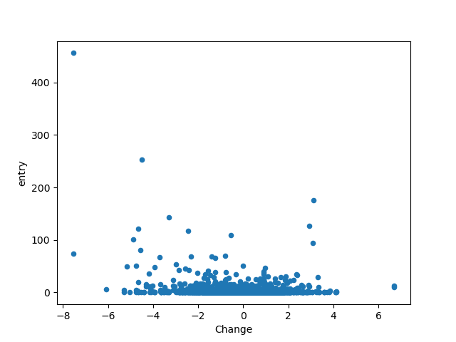

## Amaç

Ekşisözlükteki borsa istanbul başlığına yazılan entrylerin günlere göre dağılımı ile
borsa istanbulun günlük değer değişimi arasındaki ilişkiyi incelemek.

## Motivasyon

Borsa istanbul başlığında çok kez işler iyiye giderken entry yazılmadığı ama kötüye gittiğinde 
entrylerin dolup taştığı iddia ediliyordu. Durumu matematiksel olarak incelemek istedim.

## Sonuçlar

genel korelasyon

           entry    Change
           
entry   1.000000 -0.164385

Change -0.164385  1.000000

pozitif değişim için korelasyon (bist100'ün sadece artıda kapandığı günler)

           entry    Change
           
entry   1.000000  0.131958

Change  0.131958  1.000000

negatif değişim için korelasyon (bist100'ün sadece ekside kapandığı günler)

           entry    Change
           
entry   1.000000 -0.283023

Change -0.283023  1.000000

Bist100 kapanış yüzdelerine göre entry sayısı

